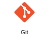
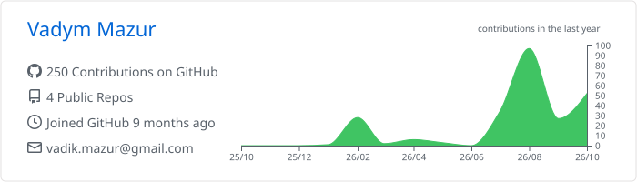

# Hi there, I'm Vadym

### QA Engineer | Manual & Automation Testing

-  **Focus:** Ensuring software quality through analytical thinking and automation
-  **Automation:** Python + Playwright / Selenium, Pytest, Allure Report
-  **Goal:** Building robust test suites that catch bugs before they reach production
-  **Location:** Ukraine

---

## Featured QA Cases

### API validation: reserved lead status

Found that lead creation accepts a status reserved for conversion. Documented the unexpected HTTP 201 response, failed Postman assertions, and persisted inconsistent state through a follow-up GET.

**Skills:** API testing · Postman · Negative testing · Data validation

[View API case study (PDF, 5 pages)](https://github.com/VadymMazur/Portfolio/blob/main/Bug_Reports/TC-API-LEAD-006_QA_Case.pdf)

### Telegram integration: connection failure

Documented a reproducible connection failure using UI and network evidence, with clear reproduction steps and follow-up investigation. Root cause remains unconfirmed; token validity was not independently verified.

**Skills:** Manual testing · Chrome DevTools · Defect reporting

[View Telegram case study (PDF, 2 pages)](https://github.com/VadymMazur/Portfolio/blob/main/Bug_Reports/CQ-2_Telegram_QA_Case.pdf)

---

### Tech Stack & Tools

#### Automation

<picture>
  <source media="(prefers-color-scheme: dark)" srcset="./assets/stack/python-dark.svg">
  <source media="(prefers-color-scheme: light)" srcset="./assets/stack/python-light.svg">
  
</picture>
<picture>
  <source media="(prefers-color-scheme: dark)" srcset="./assets/stack/playwright-dark.svg">
  <source media="(prefers-color-scheme: light)" srcset="./assets/stack/playwright-light.svg">
  
</picture>
<picture>
  <source media="(prefers-color-scheme: dark)" srcset="./assets/stack/pytest-dark.svg">
  <source media="(prefers-color-scheme: light)" srcset="./assets/stack/pytest-light.svg">
  
</picture>
<picture>
  <source media="(prefers-color-scheme: dark)" srcset="./assets/stack/selenium-dark.svg">
  <source media="(prefers-color-scheme: light)" srcset="./assets/stack/selenium-light.svg">
  
</picture>

#### API & Data

<picture>
  <source media="(prefers-color-scheme: dark)" srcset="./assets/stack/postman-dark.svg">
  <source media="(prefers-color-scheme: light)" srcset="./assets/stack/postman-light.svg">
  
</picture>
<picture>
  <source media="(prefers-color-scheme: dark)" srcset="./assets/stack/postgresql-dark.svg">
  <source media="(prefers-color-scheme: light)" srcset="./assets/stack/postgresql-light.svg">
  
</picture>

#### Testing & CI

<picture>
  <source media="(prefers-color-scheme: dark)" srcset="./assets/stack/git-dark.svg">
  <source media="(prefers-color-scheme: light)" srcset="./assets/stack/git-light.svg">
  
</picture>
<picture>
  <source media="(prefers-color-scheme: dark)" srcset="./assets/stack/githubactions-dark.svg">
  <source media="(prefers-color-scheme: light)" srcset="./assets/stack/githubactions-light.svg">
  
</picture>
<picture>
  <source media="(prefers-color-scheme: dark)" srcset="./assets/stack/jira-dark.svg">
  <source media="(prefers-color-scheme: light)" srcset="./assets/stack/jira-light.svg">
  
</picture>

**Reporting & performance:** Allure Report · Apache JMeter

Other tools

- **Web & mobile:** Swagger, Chrome DevTools, Android Studio
- **Development:** GitHub, PyCharm, Visual Studio Code
- **Test management & collaboration:** Confluence, TestRail, Trello, Notion, Slack
- **Analytics & CRM:** Google Analytics, KeepinCRM

---

###  What I Do

- Write **UI autotests** in Python with **Playwright** and **Selenium** (Page Object Model)
- Build **API tests** with **Pytest** + `requests`, validate contracts against **Swagger**
- Generate readable test reports with **Allure Report** (steps, attachments, screenshots on failure)
- Design test documentation: checklists, test cases, bug reports
- Run tests in **CI** and analyze flaky/failed runs

---

### GitHub Activity

<picture>
  <source media="(prefers-color-scheme: dark)" srcset="./assets/github-stats-dark.svg">
  <source media="(prefers-color-scheme: light)" srcset="./assets/github-stats-light.svg">
  
</picture>

---

### Connect with me

